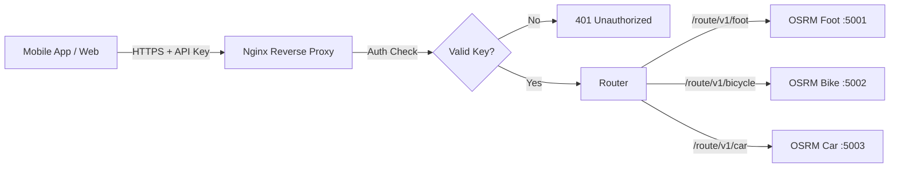

# Backend Deployment & Security Plan

Dokument ten opisuje strategię wdrożenia backendu WTG Route Machine (OSRM) oraz zabezpieczenia go przed nieautoryzowanym dostępem za pomocą klucza API (API Key).

## 1. Architektura Wdrożenia

Backend składa się z kilku kontenerów Dockerowych uruchamiających instancje OSRM dla różnych profili (pieszy, rowerowy, samochodowy) oraz serwera Nginx pełniącego rolę Reverse Proxy i bramki bezpieczeństwa.



### Komponenty:

1.  **Nginx Reverse Proxy**:
    - Obsługa SSL/TLS (Let's Encrypt).
    - Weryfikacja klucza API (`X-API-Key` header).
    - Routing zapytań do odpowiednich kontenerów na podstawie URL.
    - Rate limiting (zabezpieczenie przed DDoS).
2.  **Kontenery OSRM**:
    - Izolowane instancje dla każdego profilu.
    - Dostępne tylko w wewnętrznej sieci Dockera (nie wystawione publicznie).

## 2. Wymagania Sprzętowe (AWS / VPS)

OSRM jest pamięciożerny (RAM), szczególnie przy ładowaniu grafów (MLD/CH).

- **CPU**: 2 vCPU (zalecane dla responsywności).
- **RAM**:
  - Dla jednego miasta (np. Kraków): 4GB RAM wystarczy dla 3 profili.
  - Dla całego województwa/kraju: Wymagane znacznie więcej (np. 16GB-32GB+).
- **Disk**: 20-40GB SSD (mapy, pliki OSRM, logi).
- **OS**: Ubuntu 22.04 LTS lub Debian 11/12.

**Rekomendacja AWS**: Instancja `t3.medium` (4GB RAM) lub `t3.large` (8GB RAM) na start dla jednego dużego miasta.

## 3. Zabezpieczenie API (API Key Strategy)

Ponieważ OSRM nie posiada wbudowanej autoryzacji, zaimplementujemy ją na poziomie Nginx.

### Metoda weryfikacji

Aplikacja mobilna będzie wysyłać klucz w nagłówku HTTP:
`X-API-Key: twoj-tajny-klucz-produkcyjny`

### Konfiguracja Nginx (Snippet)

```nginx
# Definicja kluczy API (można wydzielić do osobnego pliku)
map $http_x_api_key $api_client_name {
    default       "";
    "tajny-klucz-produkcyjny-123"  "mobile_app_v1";
    "klucz-deweloperski-456"       "dev_test";
}

server {
    listen 443 ssl;
    server_name api.wtg-routes.com;

    # SSL Config...

    location / {
        # Sprawdzenie czy klucz jest poprawny
        if ($api_client_name = "") {
            return 401 '{"code": "Unauthorized", "message": "Invalid or missing API Key"}';
        }

        # Routing do odpowiednich kontenerów
        # Foot Profile
        location /route/v1/foot {
            proxy_pass http://osrm-foot:5000;
            proxy_set_header Host $host;
        }

        # Bicycle Profile
        location /route/v1/bicycle {
            proxy_pass http://osrm-bicycle:5000;
            proxy_set_header Host $host;
        }

        # Car Profile
        location /route/v1/car {
            proxy_pass http://osrm-car:5000;
            proxy_set_header Host $host;
        }
    }
}
```

## 4. Procedura Wdrożenia (Deployment Steps)

### Krok 1: Przygotowanie Serwera

1.  Aktualizacja systemu: `apt update && apt upgrade -y`.
2.  Instalacja Dockera i Docker Compose.
3.  Konfiguracja Firewalla (UFW/Security Groups):
    - Allow: 22 (SSH), 80 (HTTP), 443 (HTTPS).
    - Deny: 5001-5003 (bezpośredni dostęp do OSRM zablokowany).

### Krok 2: Pobranie Kodu i Danych

1.  Sklonowanie repozytorium na serwerze.
2.  Pobranie mapy (np. Kraków):
    ```bash
    cd backend
    ./scripts/download-map.sh malopolskie
    ./scripts/extract-city.sh malopolskie krakow
    ```

### Krok 3: Przetwarzanie Danych (Build)

Uruchomienie przetwarzania dla wszystkich profili. To najbardziej obciążający etap.

```bash
# Przykład dla Krakowa
./scripts/prepare-city-osrm.sh krakow foot
./scripts/prepare-city-osrm.sh krakow bicycle
./scripts/prepare-city-osrm.sh krakow car
```

### Krok 4: Uruchomienie Usług

Użyjemy `docker-compose.prod.yml` (który trzeba utworzyć), który zawiera definicję Nginx oraz kontenerów OSRM.

```yaml
version: '3'
services:
  nginx:
    image: nginx:alpine
    ports:
      - '80:80'
      - '443:443'
    volumes:
      - ./nginx/conf.d:/etc/nginx/conf.d
      - ./nginx/certs:/etc/letsencrypt
    depends_on:
      - osrm-foot
      - osrm-bicycle
      - osrm-car

  osrm-foot:
    image: ghcr.io/project-osrm/osrm-backend:latest
    command: osrm-routed --algorithm mld /data/krakow-foot.osrm
    volumes:
      - ./osrm-data:/data
    restart: always

  # ... definicje dla bicycle i car
```

### Krok 5: SSL (HTTPS)

Użycie Certbot do wygenerowania darmowego certyfikatu SSL.

```bash
docker run -it --rm --name certbot \
  -v "/etc/letsencrypt:/etc/letsencrypt" \
  -v "/var/lib/letsencrypt:/var/lib/letsencrypt" \
  certbot/certbot certonly --standalone -d api.twoja-domena.com
```

## 5. Monitoring i Logi

- **Logi Nginx**: Kluczowe do monitorowania prób nieautoryzowanego dostępu.
- **Docker Stats**: Monitorowanie zużycia RAM przez kontenery OSRM.
- **Uptime Robot**: Zewnętrzny monitoring dostępności API.

## 6. Planowane Zadania (TODO)

1.  [ ] Utworzyć plik `backend/docker-compose.prod.yml` z konfiguracją Nginx.
2.  [ ] Przygotować plik konfiguracyjny `backend/nginx/default.conf` z logiką API Key.
3.  [ ] Zaktualizować aplikację mobilną (Frontend), aby wysyłała nagłówek `X-API-Key` w zapytaniach do API.
4.  [ ] Wykupić domenę i skonfigurować rekordy DNS (A record) na IP serwera.
