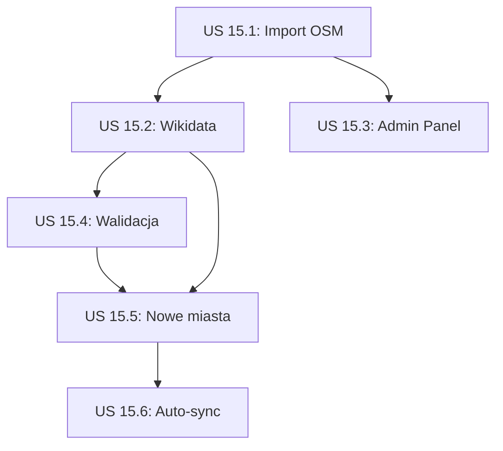

# Epic 15: Rozbudowa Bazy POI

## Przegląd

Budowa szerokiej, wysokiej jakości bazy Points of Interest (POI) dla obsługiwanych miast polskich. Celem jest dostarczenie użytkownikom bogatego zbioru atrakcji turystycznych, zabytków, restauracji i innych interesujących miejsc.

## Obecny stan

| Miasto     | Liczba POI | Status             |
| ---------- | ---------- | ------------------ |
| Kraków     | 20         | ✅ Podstawowa baza |
| Warszawa   | 19         | ✅ Podstawowa baza |
| Wrocław    | 20         | ✅ Podstawowa baza |
| Trójmiasto | 20         | ✅ Podstawowa baza |
| **TOTAL**  | **79**     | ~20 POI/miasto     |

## Cel

- **Minimum 100 POI na miasto** (400+ łącznie)
- **Zróżnicowane kategorie** - nie tylko zabytki, ale też restauracje, kawiarnie, parki
- **Dane wysokiej jakości** - opisy, zdjęcia, godziny otwarcia, ceny
- **Wielojęzyczność** - opisy PL, EN, DE, FR, UK

## Źródła danych

### 1. OpenStreetMap (OSM) - GŁÓWNE ŹRÓDŁO

**Zalety:**

- Darmowe, open-source
- Bogata baza POI dla Polski
- Regularne aktualizacje przez społeczność
- API Overpass do filtrowania

**Narzędzia:**

- [Overpass Turbo](https://overpass-turbo.eu/) - interaktywne zapytania
- [Nominatim](https://nominatim.openstreetmap.org/) - geokodowanie
- [OSM Wiki](https://wiki.openstreetmap.org/wiki/Key:tourism) - dokumentacja tagów

**Przykładowe zapytanie Overpass:**

```
[out:json][timeout:60];
area["name"="Kraków"]->.city;
(
  node["tourism"~"attraction|museum|viewpoint"](area.city);
  node["historic"~"castle|monument|memorial"](area.city);
  node["amenity"~"restaurant|cafe"](area.city);
);
out body;
```

**Kategorie OSM do wykorzystania:**

- `tourism=attraction|museum|viewpoint|gallery|artwork`
- `historic=castle|monument|memorial|ruins|archaeological_site`
- `amenity=restaurant|cafe|bar|pub`
- `leisure=park|garden`
- `building=church|cathedral|synagogue`

### 2. Wikidata / Wikipedia

**Zalety:**

- Wysokiej jakości opisy
- Wielojęzyczne treści
- Zdjęcia z Wikimedia Commons
- Strukturyzowane dane (identyfikatory, daty)

**API:**

- [Wikidata Query Service](https://query.wikidata.org/)
- [Wikipedia API](https://www.mediawiki.org/wiki/API:Main_page)

**Przykład SPARQL dla Krakowa:**

```sparql
SELECT ?item ?itemLabel ?coord ?image WHERE {
  ?item wdt:P131* wd:Q31487.  # located in Kraków
  ?item wdt:P625 ?coord.       # has coordinates
  OPTIONAL { ?item wdt:P18 ?image. }
  SERVICE wikibase:label { bd:serviceParam wikibase:language "pl,en". }
}
LIMIT 500
```

### 3. Google Places API (uzupełniające)

**Zalety:**

- Aktualne godziny otwarcia
- Oceny i recenzje
- Zdjęcia wysokiej jakości
- Informacje o popularności

**Ograniczenia:**

- Płatne powyżej limitu (200$/miesiąc free tier)
- Wymaga atrybutacji
- Ograniczenia licencyjne na cache

**Użycie:**

- Weryfikacja godzin otwarcia
- Pobieranie ocen
- Uzupełnianie brakujących danych

### 4. Lokalne portale turystyczne

**Kraków:**

- [visitkrakow.com](https://visitkrakow.com/) - oficjalny portal
- [krakow.travel](https://www.krakow.travel/) - Krakowska Organizacja Turystyczna

**Warszawa:**

- [warsawtour.pl](https://warsawtour.pl/) - Warszawska Organizacja Turystyczna

**Wrocław:**

- [visitwroclaw.eu](https://visitwroclaw.eu/) - oficjalny portal

**Trójmiasto:**

- [visitgdansk.com](https://visitgdansk.com/) - Gdańsk
- [gdynia.pl/turystyka](https://www.gdynia.pl/turystyka) - Gdynia
- [sopot.pl](https://sopot.pl/) - Sopot

### 5. Mapy.cz

**Zalety:**

- Szczegółowe dane dla Europy Środkowej
- Dobre pokrycie szlaków i punktów widokowych
- API dostępne

---

## User Stories

---

## US 15.1: Skrypt importu z OpenStreetMap

**Jako** administrator  
**Chcę** automatycznie importować POI z OpenStreetMap  
**Aby** szybko rozbudować bazę danych

### Kryteria akceptacji:

- [ ] Skrypt `npm run import:osm -- --city=krakow`
- [ ] Zapytania Overpass dla każdej kategorii
- [ ] Mapowanie tagów OSM na kategorie aplikacji
- [ ] Deduplikacja z istniejącymi POI (po współrzędnych)
- [ ] Logowanie postępu i błędów

### Mapowanie kategorii:

| OSM Tag                  | Kategoria App |
| ------------------------ | ------------- |
| tourism=museum           | museum        |
| tourism=attraction       | monument      |
| tourism=viewpoint        | viewpoint     |
| historic=castle          | historical    |
| historic=monument        | monument      |
| historic=church          | religious     |
| amenity=place_of_worship | religious     |
| amenity=restaurant       | restaurant    |
| amenity=cafe             | cafe          |
| leisure=park             | park          |
| shop=\*                  | shopping      |
| amenity=theatre/cinema   | entertainment |

### Estymacja: 2 dni

---

## US 15.2: Wzbogacanie danymi z Wikidata

**Jako** administrator  
**Chcę** uzupełnić POI o dane z Wikidata  
**Aby** mieć wysokiej jakości opisy i zdjęcia

### Kryteria akceptacji:

- [ ] Skrypt `npm run enrich:wikidata`
- [ ] Matchowanie POI z encjami Wikidata (po nazwie + lokalizacji)
- [ ] Pobieranie opisów wielojęzycznych (PL, EN, DE, FR, UK)
- [ ] Pobieranie URL zdjęć z Wikimedia Commons
- [ ] Pobieranie linków do Wikipedii
- [ ] Zapisywanie Wikidata ID w POI (dla przyszłych aktualizacji)

### Dane do pobrania:

- `description` (wielojęzyczne)
- `P18` - image
- `P856` - official website
- `P625` - coordinates (weryfikacja)
- `P1566` - GeoNames ID

### Estymacja: 1.5 dnia

---

## US 15.3: Panel zarządzania POI w Admin

**Jako** administrator  
**Chcę** zarządzać POI przez panel administracyjny  
**Aby** móc dodawać, edytować i usuwać POI

### Kryteria akceptacji:

- [ ] Lista POI z filtrowaniem (miasto, kategoria, status)
- [ ] Wyszukiwanie po nazwie
- [ ] Formularz dodawania/edycji POI:
  - [ ] Mapa do wyboru lokalizacji
  - [ ] Pola wielojęzyczne (tabs)
  - [ ] Upload zdjęcia lub URL
  - [ ] Wybór kategorii
  - [ ] Godziny otwarcia (opcjonalne)
- [ ] Bulk actions (delete, change category)
- [ ] Import z CSV/JSON

### Estymacja: 3 dni

---

## US 15.4: Walidacja i jakość danych

**Jako** administrator  
**Chcę** mieć narzędzia do weryfikacji jakości POI  
**Aby** zapewnić spójność i kompletność danych

### Kryteria akceptacji:

- [ ] Dashboard jakości w Admin:
  - [ ] POI bez opisów
  - [ ] POI bez zdjęć
  - [ ] POI z brakującymi tłumaczeniami
  - [ ] POI z niepoprawnymi współrzędnymi
- [ ] Skrypt walidacji: `npm run validate:pois`
- [ ] Automatyczne wykrywanie duplikatów (podobna nazwa + bliska lokalizacja)
- [ ] Raport jakości per miasto

### Metryki jakości:

- % POI z opisem PL
- % POI z opisem EN
- % POI z zdjęciem
- % POI z godzinamiotwarcia
- Średnia długość opisu

### Estymacja: 1.5 dnia

---

## US 15.5: Import POI dla nowych miast

**Jako** product owner  
**Chcę** łatwo dodawać nowe miasta do aplikacji  
**Aby** rozszerzać zasięg usługi

### Kryteria akceptacji:

- [ ] Skrypt `npm run import:city -- --name="Poznań" --osm-id=12345`
- [ ] Automatyczne pobranie bbox z OSM
- [ ] Import POI z OSM
- [ ] Wzbogacenie danymi z Wikidata
- [ ] Raport z importu (liczba POI per kategoria)

### Kolejne miasta do rozważenia:

1. **Poznań** - duże miasto, dużo atrakcji
2. **Łódź** - unikalna architektura przemysłowa
3. **Zakopane** - turystyka górska
4. **Toruń** - UNESCO, gotyk
5. **Lublin** - wschodnia Polska
6. **Szczecin** - zachodnia Polska

### Estymacja: 1 dzień

---

## US 15.6: Automatyczna aktualizacja POI

**Jako** administrator  
**Chcę** aby dane POI były automatycznie aktualizowane  
**Aby** informacje były zawsze aktualne

### Kryteria akceptacji:

- [ ] Cron job: cotygodniowe sprawdzanie zmian w OSM
- [ ] Wykrywanie usuniętych/zmienionych POI
- [ ] Powiadomienia o istotnych zmianach
- [ ] Historia zmian (audit log)
- [ ] Manual trigger: `npm run sync:osm`

### Estymacja: 2 dni

---

## Podsumowanie estymacji

| User Story | Nazwa                     | Estymacja  | Priorytet |
| ---------- | ------------------------- | ---------- | --------- |
| US 15.1    | Import z OSM              | 2 dni      | 🔴 High   |
| US 15.2    | Wzbogacanie z Wikidata    | 1.5 dnia   | 🔴 High   |
| US 15.3    | Panel POI w Admin         | 3 dni      | 🟡 Medium |
| US 15.4    | Walidacja jakości         | 1.5 dnia   | 🟡 Medium |
| US 15.5    | Import nowych miast       | 1 dzień    | 🟢 Low    |
| US 15.6    | Automatyczna aktualizacja | 2 dni      | 🟢 Low    |
| **TOTAL**  |                           | **11 dni** |           |

## Rekomendowana kolejność



## Docelowa struktura POI

```json
{
  "id": "krakow-wawel-castle",
  "cityId": "krakow",
  "wikidataId": "Q189315",

  "namePl": "Zamek Królewski na Wawelu",
  "nameEn": "Wawel Royal Castle",
  "nameDe": "Königsschloss Wawel",
  "nameFr": "Château royal du Wawel",
  "nameUk": "Вавельський замок",

  "descriptionPl": "Historyczna rezydencja królów polskich...",
  "descriptionEn": "Historic residence of Polish kings...",

  "category": "historical",
  "subcategory": "castle",

  "latitude": 50.054,
  "longitude": 19.9354,
  "address": "Wawel 5, 31-001 Kraków",

  "imageUrl": "https://upload.wikimedia.org/...",
  "thumbnailUrl": "https://...",

  "openingHours": {
    "mon": null,
    "tue": "09:30-17:00",
    "wed": "09:30-17:00",
    "thu": "09:30-17:00",
    "fri": "09:30-17:00",
    "sat": "10:00-18:00",
    "sun": "10:00-18:00"
  },

  "website": "https://wawel.krakow.pl",
  "phone": "+48 12 422 51 55",
  "email": "info@wawel.krakow.pl",

  "ticketPrice": {
    "adult": 25,
    "reduced": 15,
    "currency": "PLN"
  },

  "estimatedTime": 120,
  "accessibility": ["wheelchair", "elevator"],
  "tags": ["UNESCO", "zamek", "król", "historia"],

  "rating": 4.8,
  "reviewCount": 15234,

  "osmId": "way/123456",
  "googlePlaceId": "ChIJ...",

  "status": "published",
  "verified": true,
  "lastVerifiedAt": "2025-12-01T00:00:00Z",

  "createdAt": "2025-01-01T00:00:00Z",
  "updatedAt": "2025-12-10T00:00:00Z"
}
```

## Metryki sukcesu

| Metryka                    | Cel         |
| -------------------------- | ----------- |
| Liczba POI łącznie         | 400+        |
| POI na miasto (min)        | 100         |
| POI z opisem PL            | 100%        |
| POI z opisem EN            | 90%         |
| POI ze zdjęciem            | 80%         |
| POI z godzinami otwarcia   | 50%         |
| Czas importu nowego miasta | < 1 godzina |

## Ryzyka i mitygacja

| Ryzyko                       | Prawdopodobieństwo | Mitygacja                           |
| ---------------------------- | ------------------ | ----------------------------------- |
| Niekompletne dane OSM        | Średnie            | Uzupełnianie z Wikidata/ręcznie     |
| Licencje zdjęć               | Niskie             | Tylko Wikimedia Commons (CC)        |
| Rate limiting API            | Niskie             | Caching, batch requests             |
| Nieaktualne godziny otwarcia | Wysokie            | Regularna weryfikacja, user reports |
| Duplikaty POI                | Średnie            | Deduplikacja po współrzędnych       |
